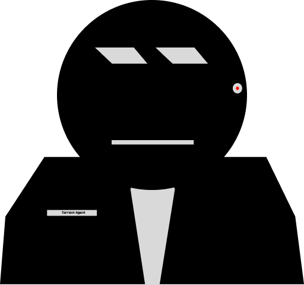

<div align="center">

<h1 align="center">Torrent Agent</h1>
</div>

Torrent Agent is an npm library for searching torrents from torrent sites like 1337x, YTS, etc. It can run multiple queries concurrently and manage multiple scrapers that looks for torrents from differente providers in the same time.

## How to use it

Torrent agent is still in development and it's not actually available in npm, but you can clone it
manually.

```shell
$ npm i
$ tsc
```

create a js file and import the library.

example :

```js
import TorrentAgent from "./dist/index.js";

const agent = new TorrentAgent();

let q = agent.add({
  searchQuery: "Ubuntu",
  options: {
    limit: 20,
    concurrency: 10,
  },
});

// Listen for torrents
q.on("torrent", (t) => {
  console.log(t);
});
// Listen for errors
q.on("error", (e) => {
  console.log(e);
});
// Listen for query completion
q.on("done", () => {
  console.log("done");
});
```
