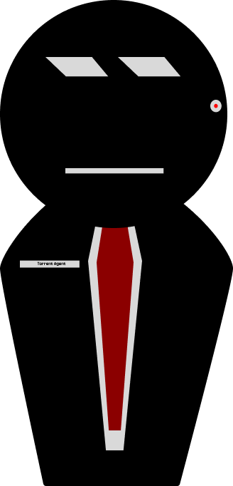

<div align="center">

<h1 align="center">Torrent Agent</h1>
</div>

Torrent Agent is an npm library for searching torrents from torrent sites like 1337x, YTS, etc. It can run multiple queries concurrently and manage multiple scrapers that looks for torrents from differente providers in the same time.

## How to use it

```shell
$ npm i torrent-agent
```

create a js file and import the library.

example :

```js
import TorrentAgent from "torrent-agent";

const agent = new TorrentAgent();

async function getTorrents() {
  let query = await agent.add({
    searchQuery: "Ubuntu",
    options: {
      limit: 20,
      concurrency: 5,
    },
  });

  // Listen for torrents
  query.on("torrent", (torrent) => {
    console.log(torrent);
  });
  // Listen for errors
  query.on("error", (e) => {
    console.log(e);
  });
  // Listen for query completion
  query.on("done", () => {
    console.log("done");
  });
}
```

#### Default scrapers :

- Torrent Galaxy
- Nyaa

> More scrapers will be available soon

#### Default Chromium scrapers :

- The Pirate Bay
  > **Note:** To use these scrapers, set `allowChromiumScrapers` in the agent config. You must have Chromium installed on your OS. Keep in mind that Chromium uses more memory, which means Chromium scrapers will be heavier than the normal ones and take more time.

```js
const agent = new TorrentAgent({ allowChromiumScrapers: true });
```

#### Custom scrapers

You can create your own custom scrapers that scrape from any site.
The custom scraper need to extend from the scraper abstract class.

```js
class CustomScraper extends Scraper {
  constructor(opts: ScraperOpts) {
    super(opts);
  }
  async firstTouch(query: string, limit?: number): Promise<TorrentLink[]> {
    // search page scraping logic
  }
  async scrapeTorrent(link: TorrentLink): Promise<Torrent> {
    // torrent page scraping logic
  }
}

// then create the agent
const agent = new TorrentAgent();
// use your custom scraper in your query
let query = agent.add({
  searchQuery: "Ubuntu",
  options: {
    limit: 20,
    concurrency: 10,
  },
  scrapers: [new CustomScraper()],
});
query.on("torrent", (t) => {
  console.log(t);
});
```
